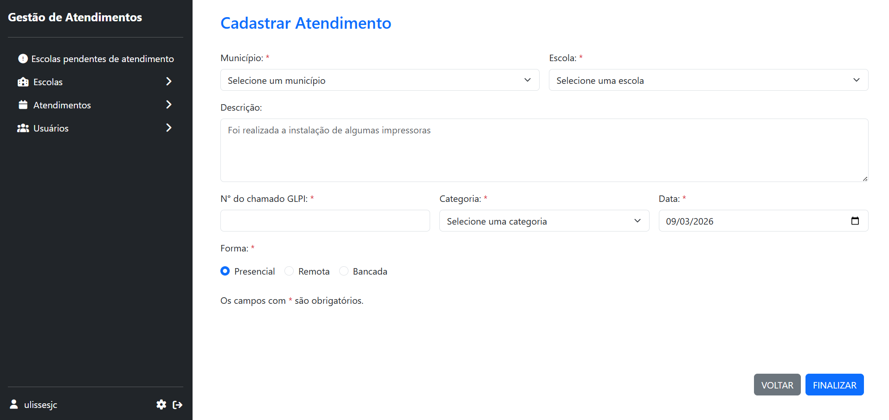
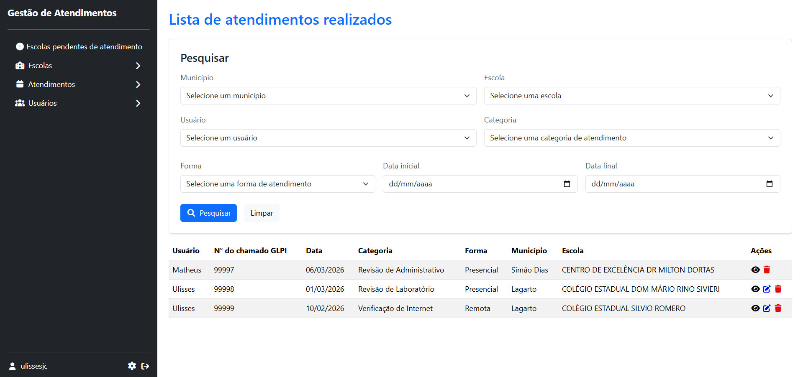
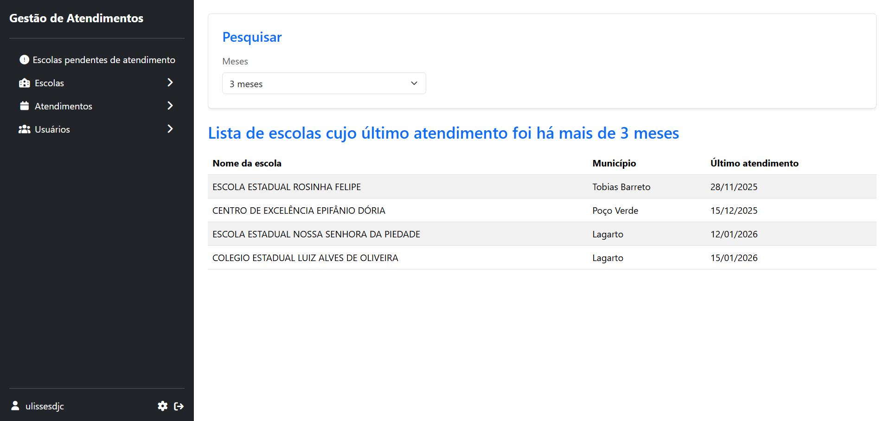

# AtendManager

Sistema web desenvolvido para gerenciar atendimentos realizados pela equipe de suporte nas escolas da rede estadual de ensino, permitindo registrar, organizar e acompanhar as atividades realizadas nas unidades escolares.

## Tecnologias utilizadas

- PHP
- Laravel
- PostgreSQL
- Blade / HTML / CSS / JS

## Principais funcionalidades

- Gerenciamento de atendimentos
- Gerenciamento de usuários
- Gerenciamento de escolas
- Visualização de escolas sem atendimentos há N meses

## Sobre o projeto

Este projeto foi desenvolvido durante meu estágio em Suporte de TI e Desenvolvimento Web, na Diretoria Regional de Educação – DRE 2, com o objetivo de auxiliar na gestão dos atendimentos realizados nas escolas pela equipe de suporte.

## Imagens

### Tela de login

### Formulário de cadastro de um atendimento

### Lista de atendimentos cadastrados

### Relatório de escolas sem atendimento há determinado período

